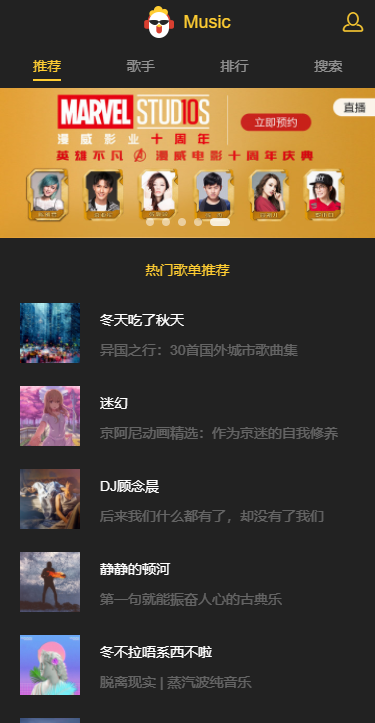
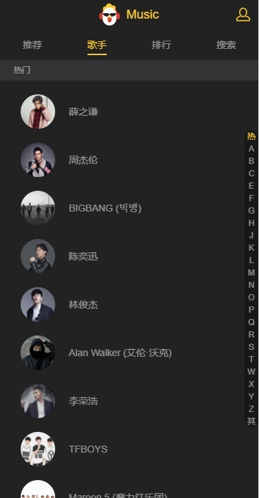
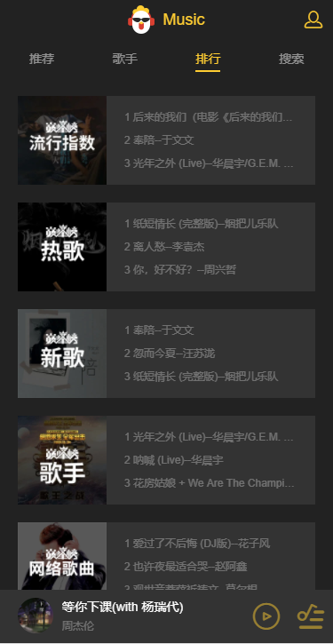

# 一个移动端音乐的webApp项目
## 概述
项目是基于vue.js, 通过vue-cli脚手架构建开发环境,使用了vue-route, vuex, 使用better-scroll做滚动, axios做数据抓取
## 页面效果





## 项目目录
1. 推荐页
2. 歌手页
3. 排行榜页
4. 搜索页
5. 用户中心
## 数据的来源
数据来源于`https://y.qq.com`中,部分接口可以直接获取,部分接口需要设置header后获取
## 技术栈
- vue
- vuex
- vue-router
- vue-cli
- axios
- better-scroll

## 初始化项目
```
vue init webpack vue-music
```
```
|-- build                           // 项目开发环境配置
|   |-- webpack.base.conf.js        // 基础环境变量
|   |-- webpack.dev.conf.js         // 开发环境变量
|   |...

// webpack.base.conf.js
// 添加别名
resolve: {
    extensions: ['.js', '.vue', '.json'],
    // 别名
    alias: {
        '@': resolve('src'),
        'api': resolve('src/api'),
        'base': resolve('src/base'),
        'vue$': 'vue/dist/vue.esm.js',
        'common': resolve('src/common'),
        'components': resolve('src/components')
    }
},

// webpack.dev.conf.js
// 初始化路由做准备
const express = require('express')
var apiRoutes = express.Router();
```
```
|-- config                          // 配置变量
|   |-- index.js                    // 配置开发模式或生产模式的变量
|   |...
// index.js
// 修改本地环境地址
host: '192.168.0.101'
```
```
|.eslintrc.js                 // eslint配置
|index.html                   // 入口页面
|package.json                 // 项目信息
|...
```
```
|-- src                        
|   |-- api                    // 存放接口的js
|   |-- base                   // 存放公共组件
|   |-- common                 // 存放公共的字体,css,image,js的文件
|   |-- components             // 存放业务组件
|   |-- router                 // 路由index文件
|   |-- store                  // vuex相关文件
|App.vue                       // 页面入口文件
|main.js                     // 程序入口文件
```
## 首页header的创建
1. 顶部是公共组件
2. 导航区是路由
3. 在App.vue中布局初始的结构,在components中新增Mheader组件,并引入到App.vue中
4. 在router下的index.js中配置路由环境
## 推荐页
1. 推荐页中loading图的使用
    1. loading是公共组件
    2. loading显示的条件是获取的数据不存在时(v-show)
2. 滚动组件
    1. 滚动时公共组件
    2. 滚动组件需要添加插槽`slot`标签,并且在引用时需要传入参数`data`等,当滚动组件需`watch``data`并`refresh()`
    3. [better-scroll](https://www.imooc.com/article/18232)
3. 图片懒加载插件
```
// main.js 
import VueLazyload from 'vue-lazyload';
Vue.use(VueLazyload, {
    loading: require('./common/images/loading.gif')
});
// 把需要懒加载的img的src改成v-lazy=""
```
4. 动画
    1. 在需要添加动画的标签用`transition`包裹,并自定义动画
## 歌手页
1. 歌手列表
    1. 列表和快速定位存在关联关系,将歌手列表高度值存为数组区间根据区间定位是在哪个标签下
2. 歌曲详情列表(公共组件)
    1. 公共组件多处引用,因此需要接收不同的参数
3. 播放组件(全局组件)
    1. 全局组件使用vuex来保存,在App.vue中引用
    2. audio标签派发ready事件,因此播放组件根据这个事件来保存并`watch`这个值,如果为`false`则播放器不会播放,防止频繁点击下一首的情况
    3. 在`src/common/js/song.js`创建`song`类来保存我们需要的数据
## 排行页
1. 使用歌曲详情列表(公共组件),因此传入需要的数据即可

## 地址
[music](https://github.com/helingang/demo/tree/master/Demo-music)