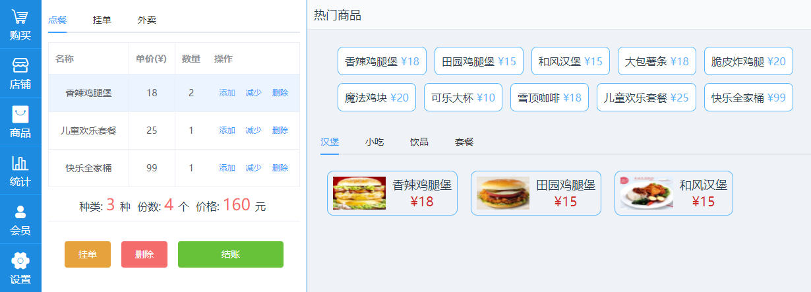

# Vue练习
1. 初步使用ele快速搭建
2. 使用axios获取接口数据
## 预览

## 初始化项目
```
vue init webpack pos
cd pos
npm run dev
```
## 左侧导航
1. 新增左侧导航组件,组件使用`<router-link></router-link>`导航到指定路由,并在路由中设置路由的组件主界面`pos.vue`
2. 字体样式
项目使用[阿里图标](http://www.iconfont.cn),首先选择喜欢的图标然后将href地址引入到link标签中
## 主界面
1. [element](http://element-cn.eleme.io/#/zh-CN/component/quickstart)的引入
    1. 在`main.js`中引入`Vue.use(ElementUI)`
    2. 横向分栏`<el-row></el-row>`
    3. 纵向分栏`<el-col :span="24"></el-col>`,分栏数和为24
    4. 标签页`<el-tab></el-tab>`,标签页中的项目用`<el-tab-pane label='点餐'></el-tab-pane>`表示
    5. 表格属性`<el-table></el-table>`,并在标签中绑定data值,表头用`<el-table-column></el-table-column>`表示
    6. 按钮标签`<el-button type='warning'>挂单</el-button>`,可以设置多种type属性
## 地址
[pos](https://github.com/helingang/demo/tree/master/Demo-pos)