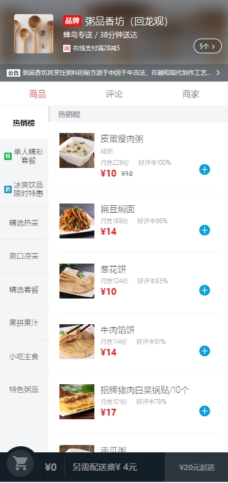
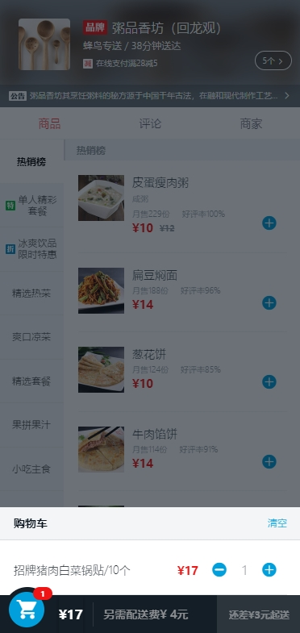
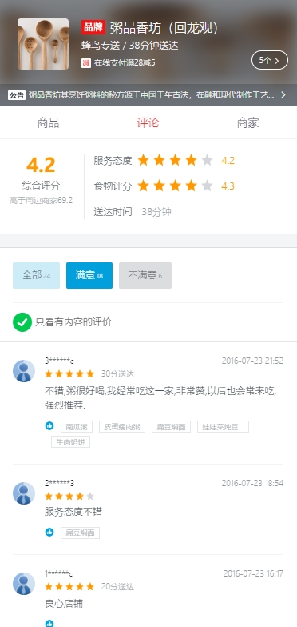
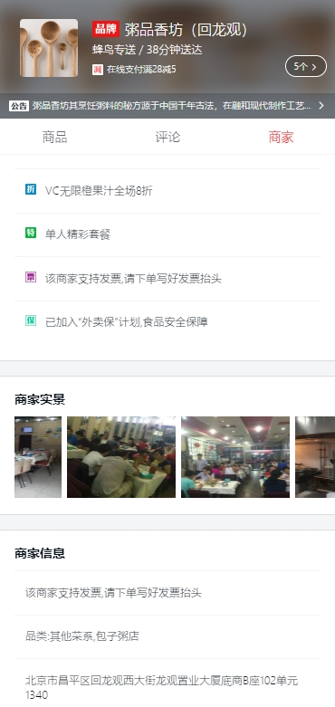

# webApp
## 页面效果






## 技术栈
1. vue.js
2. vue-router做前端路由实现SPA应用
3. better-scroll实现列表滚动
4. vue-cli脚手架

## 项目目录
```
── src
|    ├── App.vue
|    ├── main.js
|    ├── assets
|    │   └── logo.png
|    ├── common         // 公共引用的资源的目录
|    │   ├── js     
|    │   └── stylus     
|    ├── components     // 组件的目录
|    │   ├── goods
|    │   ├── header
|    │   ├── ratings
|    │   ├── seller
|    │   └── ...

```

## 数据来源
1. 本地的data.json文件
2. 后台模拟数据
```
const express = require('express')
var appData = require('../data.json');
var seller = appData.seller;
var goods = appData.goods;
var ratings = appData.ratings;
var apiRoutes = express.Router();

// devServer中
devServer: {
    before(apiRoutes){
        apiRoutes.get('/api/seller', function(req, res){
            res.json({
                // errno为0一般表示为正常
                errno: 0,
                data: seller
            });
        });
        apiRoutes.get('/api/goods', function(req, res){
            res.json({
                errno: 0,
                data: goods
            });
        });
        apiRoutes.get('/api/ratings', function(req, res){
            res.json({
                errno: 0,
                data: ratings
            });
        });
    }
}
```

## 头部组件
1. vue的v-for遍历
2. vue的v-show显示
3. 监听click事件
4. 动画处理
5. 数据缓存`keep-alive`
6. 将活动对应的class类用数据保存,使用类名和数组下标来对哪种活动进行切换
7. 在父级使用`font-size=0`消除子级行内块元素的间距问题
8. 评分组件(公共组件)
    1. 多处调用,需要传入参数,`size`和`score`
    2. 根据当前分数做`Math.floor`判断应该显示的分数和五角星个数
    3. 星星图片用类名控制,例如 3.5分/5分的五角星数组为`[on,on,on,half,off]`

## 路由分区
1. 路由分为 商品 评价 商家 三个区域 
## 商品区
1. 使用左右flex布局,定宽`flex: 0 0 80px`
2. 传递事件函数的`$event`参数
3. 对dom进行操作使用$refs进行操作(如果是vue组件则需要添加$el)
4. 在绑定的class中使用条件判断
5. v-if和v-show, v-if为false时不会渲染dom,v-show则是添加`display: none`
6. 阻止默认事件`@click.stop.prevent=""`
7. 选择商品后添加到`selectFood`中
## 购物车
1. 购物车的数据绑定`selectFood`,当selectFood数据改变时购物车对应改变
## 商品详情
1. `position: fix; left: 0; top: 0;`布局
2.  进入和退出的动画
3. `padding-top: 100%`的技巧,防止图片加载失败时图片的位置被占据
4. `Vue.set(a, b, c)`添加a对象的一个属性b为值c
## 商家区
1. 横向滚动,这是`better-scroll`的参数 `scrollX: true`
## 评价区
1. `flex`布局
2. `filter`过滤时间,在插值后添加函数名,并把函数名添加到filter这个对象下
3. 评价组件(公共组件)
    1. 需要传入参数, 当前选择的查询条件, 是否查看有内容的评价, 每个商品下的所有评论
    2. 公共组件将选择的查询条件参数通过事件的方式`$emit`告诉父级,父级根据查询的条件来判断显示哪些评论


## 地址
[sell](https://github.com/helingang/demo/tree/master/Demo-sell)
